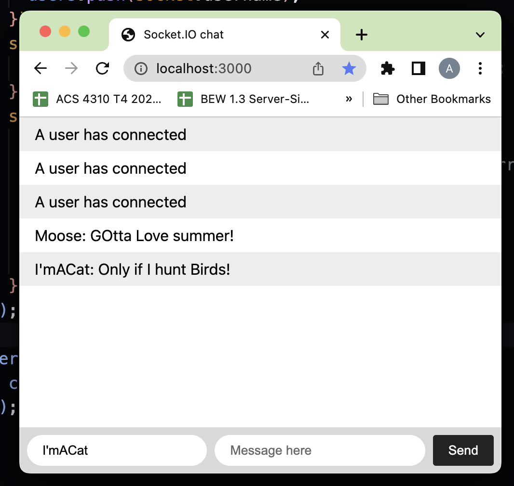

### Chat Application

This Chat Application is a real-time messaging platform built using Node.js, Express.js, and Socket.IO. It allows users to enter their desired username, send messages, and instantly communicate with other connected users. The application provides a seamless chatting experience, with new user notifications and disconnection alerts. The server-side is developed using Node.js and Express.js, while the client-side communication is handled by Socket.IO, enabling real-time bidirectional event-based communication between the server and clients.

